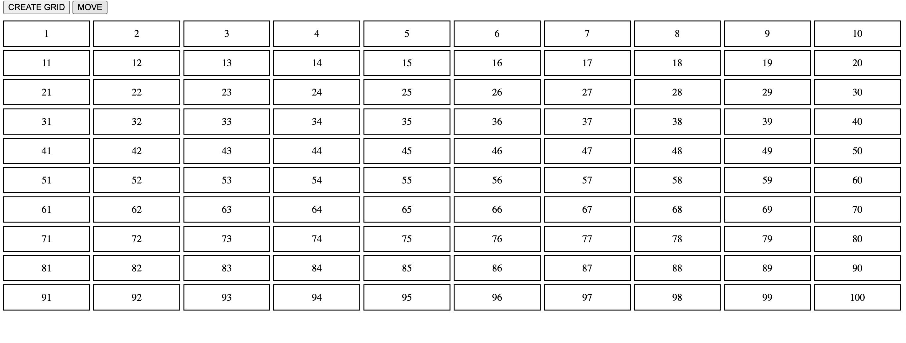
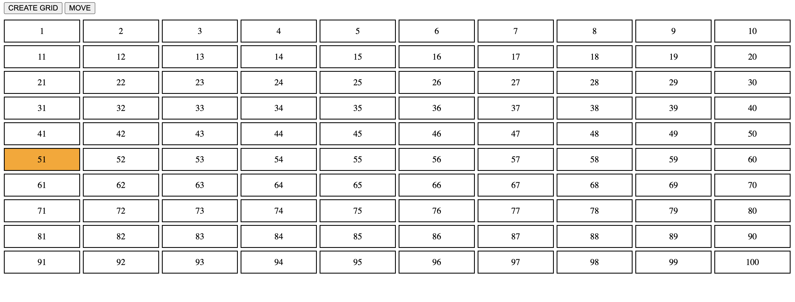

# grid
Creating a grid programmatically 

<h2>Description</h2>

A program where you can create a grid programatically by clicking a buton and higlights one cell at a time. 

<h2>Installation</h2>
You may fork the "bringing it together"  and open it in your browser of choice. Once in the browser you will see this screes with two buttons.
The first one is "CREATE GRID" and the other one is "MOVE. 

+ Click on "CREATE GRID" to create the grid with 100 cells.
+ CLick on "MOVE" to higlight each cell at a time in order from 1-100

 

<h2>Usage</h2>

Feel free to open the html file along with the images in the IDE of your choice where you could do the following things:

+ Change the color for selecting each cell
+ Add more cells
+ Style the cells, rows/columns

 

<h2>Support</h2>

Should you have any questions or concerns email me anakorellana@gmail.com

<h2>RoadMap</h2>

The goal is to practing using the DOM, by appending, using loops, style a webpage programatically.

<h2>License</h2>

This is an open source project.Enjoy!

